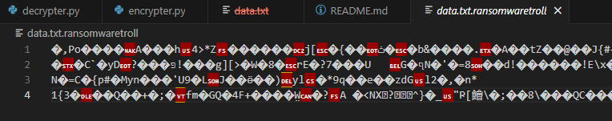
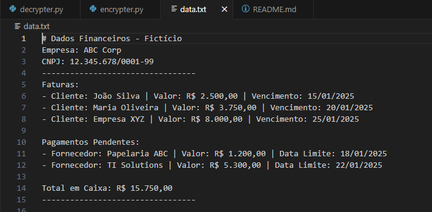

# Teste de Ransomware para criptografia de arquivos

Este repositório foi criado para execução de um desafio de código no Bootcamp de Cibersegurança da DIO.

O projeto teve por objetivo criar 2 arquivos, um para criptografar e outro para descriptografar um arquivo de texto, simulando um ataque de ransomware real que acontece com diversas empresas e usuários.

Para este projeto a criptografia utilizada foi a AES, um algoritmo de criptografia simétrica que utiliza a mesma chave para criptografar e descriptografar.

A chave utilizada possui 128 bits, sendo apenas um teste para introduzir os conhecimentos sobre os perigos de ataques de ransomware.

Neste cenário busquei replicar um caso em que um atacante acessa um dispositivo em que há o armazenamento de dados financeiros em um arquivo de texto. Neste cenário o atacante poderia criptografar e ameaçar as vitimas sobre a exposição ou a não devolução dos dados, sendo dados financeiros cruciais para a gestão financeira de uma organização.

OBS.: Os dados utilizados são fictícios, não refletindo a realidade de nenhuma empresa verdadeira.

## Uso do código

Para utilizar o código em questão, basta clonar o repositório ou baixar os arquivos em sua máquina.

Instale a lib pyaes com o pip:

```bash
pip install pyaes
```

Para criptografar o arquivo utilize o comando:

```bash
python3 encrypter.py
```

Verifique o arquivo novo gerado com a extensão final ".ransomwaretroll", este terá os dados criptografados.



Para descriptografar o arquivo utilize o comando:

```bash
python3 decrypter.py
```

E o arquivo ".txt" estará de volta com suas informações legíveis novamente.




